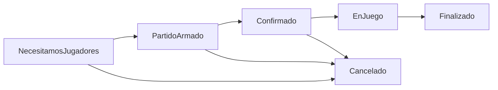

# 🎾 UnoMas - Sistema de Gestión de Partidos Deportivos


---

## 📋 Descripción

**UnoMas** es una aplicación web desarrollada en Spring Boot que permite a usuarios crear, gestionar y participar en partidos deportivos. Implementa múltiples **patrones de diseño** (State, Observer, Strategy, Adapter) para una arquitectura robusta y escalable.

---

## 🎯 Funcionalidades Principales

- Registro y gestión de usuarios (jugadores)
- Creación, búsqueda y gestión de partidos deportivos
- Estados automáticos de partidos: NecesitamosJugadores → PartidoArmado → Confirmado → EnJuego → Finalizado/Cancelado
- Notificaciones automáticas por email y push (Observer + Adapter)
- Invitaciones automáticas usando estrategias de emparejamiento (Strategy): por cercanía, por nivel (mínimo el del partido), por historial
- Endpoints REST públicos (sin autenticación activa)
- Configuración y consulta de zonas, deportes y niveles
- Estadísticas de jugadores

---

## 🏗️ Arquitectura y Patrones de Diseño

| Patrón      | Implementación                        | Propósito                                      |
|------------|---------------------------------------|------------------------------------------------|
| State      | Estados de Partido                    | Gestión automática del ciclo de vida de partidos|
| Observer   | Sistema de notificaciones             | Notificaciones automáticas de cambios           |
| Strategy   | Algoritmos de emparejamiento          | Diferentes criterios de invitación              |
| Adapter    | Servicios de notificación             | Integración con Email/Push unificada            |

### 📊 Flujo de Estados (State Pattern)



---

## 🌐 API REST - Endpoints

### 📊 Swagger Documentation

La documentación interactiva está disponible en:
```
http://localhost:8080/swagger-ui.html
```

### Endpoints principales

#### **Partidos** (`/api/partidos`)
| Método | Endpoint | Descripción |
|--------|----------|-------------|
| POST   | `/api/partidos` | Crear nuevo partido |
| POST   | `/api/partidos/buscar` | Buscar partidos por criterios |
| GET    | `/api/partidos/{id}` | Obtener partido por ID |
| POST   | `/api/partidos/{id}/unirse` | Unirse a un partido |
| POST   | `/api/partidos/{id}/salirse` | Salirse de un partido |
| POST   | `/api/partidos/{id}/cancelar` | Cancelar partido (organizador) |
| POST   | `/api/partidos/{id}/confirmar` | Confirmar participación |
| GET    | `/api/partidos/jugador/{jugadorId}` | Partidos de un jugador |
| GET    | `/api/partidos/compatibles/{jugadorId}` | Buscar partidos compatibles para un jugador |

#### **Jugadores** (`/api/jugadores`)
| Método | Endpoint | Descripción |
|--------|----------|-------------|
| POST   | `/api/jugadores/registro` | Registrar nuevo jugador |
| GET    | `/api/jugadores` | Obtener todos los jugadores |
| GET    | `/api/jugadores/{id}` | Obtener jugador por ID |
| GET    | `/api/jugadores/zona/{zonaId}` | Jugadores por zona |
| GET    | `/api/jugadores/email/{email}` | Buscar por email |
| PUT    | `/api/jugadores/{id}` | Actualizar perfil |
| GET    | `/api/jugadores/{id}/estadisticas` | Estadísticas del jugador |

#### **Configuración** (`/api/configuracion`)
| Método | Endpoint | Descripción |
|--------|----------|-------------|
| GET    | `/api/configuracion/zonas` | Obtener zonas disponibles |
| GET    | `/api/configuracion/deportes` | Obtener deportes disponibles |
| GET    | `/api/configuracion/niveles` | Obtener niveles disponibles |
| POST   | `/api/configuracion/datos-prueba` | Crear datos de prueba |

---

## 🔄 Flujos Automáticos y Ejemplo de Uso

### Flujo de creación y gestión de partido
1. **Crear partido**: POST `/api/partidos` → Estado inicial: `NecesitamosJugadores`.
2. **Invitaciones automáticas**: Observer + Strategy envían invitaciones a jugadores compatibles.
3. **Jugadores se unen**: POST `/api/partidos/{id}/unirse?jugadorId=X`.
4. **Al alcanzar el mínimo**: Estado pasa a `PartidoArmado` automáticamente.
5. **Confirmación de asistencia**: POST `/api/partidos/{id}/confirmar?jugadorId=X`.
6. **Todos confirman**: Estado pasa a `Confirmado`.
7. **Llega la hora**: Estado pasa a `EnJuego` automáticamente.
8. **Finaliza duración**: Estado pasa a `Finalizado` automáticamente.
9. **Cancelación**: POST `/api/partidos/{id}/cancelar?organizadorId=X` (solo organizador).

### Ejemplo de request para crear partido
```json
{
  "titulo": "Fútbol 5 del Viernes",
  "fechaHora": "2024-06-15T19:00:00",
  "zonaId": 1,
  "deporteId": 1,
  "nivel": "INTERMEDIO",
  "organizadorId": 1,
  "duracionMinutos": 90
}
```

### Ejemplo de búsqueda de partidos
```json
{
  "zonaId": 1,
  "deporteId": 1,
  "nivel": "INTERMEDIO",
  "soloConEspaciosDisponibles": true
}
```

---

## 🛡️ Seguridad

- **Autenticación JWT desactivada** por defecto. Todos los endpoints son públicos para testing y demo.
- Para activar autenticación, modificar `SecurityConfig.java`.

---

## 🧩 Extensibilidad

- Agrega nuevas estrategias de emparejamiento implementando `EstrategiaEmparejamiento`.
- Nuevos canales de notificación: implementa `INotificacionStrategy` o usa Adapter.
- Nuevos estados: implementa `EstadoPartido`.

---

## 👨‍💻 Equipo y Contacto

- [GitHub](https://github.com/tu-usuario/unoMas)
- Email: soporte@unomas.com

---

## Licencia

MIT License 