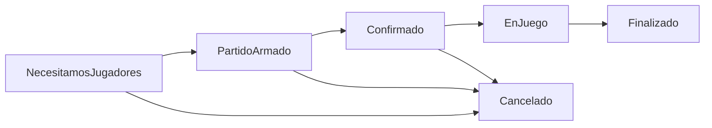

# 🎾 UnoMas - Sistema de Gestión de Partidos Deportivos


## 📋 Descripción

**UnoMas** es una aplicación web desarrollada en Spring Boot que permite a usuarios crear, gestionar y participar en partidos deportivos. Implementa múltiples **patrones de diseño** para demostrar arquitectura de software robusta y escalable.

## 🎯 Funcionalidades Principales

### ✅ Requerimientos Funcionales Implementados

| RF | Descripción | Estado |
|---|---|---|
| **RF1** | Registro de usuarios en el sistema | ✅ Completo |
| **RF2** | Búsqueda de partidos disponibles por zona | ✅ Completo |
| **RF3** | Creación de partidos deportivos | ✅ Completo |
| **RF4** | Gestión automática de estados de partidos | ✅ Completo |
| **RF5** | Sistema de notificaciones por email/push | ✅ Completo |
| **RF6** | Invitaciones automáticas con estrategias | ✅ Completo |

## 🏗️ Arquitectura y Patrones de Diseño

### 🎨 Patrones Implementados

| Patrón | Implementación | Propósito |
|---|---|---|
| **🎯 State** | Estados de Partido | Gestión de ciclo de vida de partidos |
| **👀 Observer** | Sistema de notificaciones | Notificaciones automáticas de cambios |
| **🔧 Strategy** | Algoritmos de emparejamiento | Diferentes criterios de búsqueda de jugadores |
| **🔌 Adapter** | Servicios de notificación | Integración con Email/Push unificada |

### 📊 Flujo de Estados (State Pattern)



**Estados implementados:**
- **🟡 NecesitamosJugadores**: Estado inicial, faltan jugadores
- **🟢 PartidoArmado**: Mínimo de jugadores alcanzado
- **✅ Confirmado**: Todos los jugadores confirmaron
- **🏃 EnJuego**: Partido en curso
- **🏆 Finalizado**: Partido terminado
- **❌ Cancelado**: Partido cancelado

## 🌐 API REST - Endpoints

### 📊 Swagger Documentation

La documentación interactiva está disponible en:
```
http://localhost:8080/swagger-ui.html
```

### 🎮 Controllers

#### 1. **PartidoController** - `/api/partidos`

| Método | Endpoint | Descripción |
|---|---|---|
| `POST` | `/api/partidos` | **Crear partido nuevo** |
| `POST` | `/api/partidos/buscar` | **Buscar partidos con filtros** |
| `GET` | `/api/partidos/{id}` | Obtener partido por ID |
| `POST` | `/api/partidos/{id}/unirse` | Unirse a partido |
| `POST` | `/api/partidos/{id}/salirse` | Salirse de partido |
| `POST` | `/api/partidos/{id}/cancelar` | Cancelar partido (solo organizador) |
| `POST` | `/api/partidos/{id}/confirmar` | Confirmar participación |
| `GET` | `/api/partidos/jugador/{jugadorId}` | Partidos de un jugador |

#### 2. **JugadorController** - `/api/jugadores`

| Método | Endpoint | Descripción |
|---|---|---|
| `POST` | `/api/jugadores/registro` | **Registrar nuevo usuario** |
| `GET` | `/api/jugadores` | Obtener todos los jugadores |
| `GET` | `/api/jugadores/{id}` | Obtener jugador por ID |
| `GET` | `/api/jugadores/zona/{zonaId}` | Jugadores por zona |
| `GET` | `/api/jugadores/email/{email}` | Buscar por email |
| `PUT` | `/api/jugadores/{id}` | Actualizar perfil |
| `GET` | `/api/jugadores/{id}/estadisticas` | Estadísticas del jugador |

#### 3. **ConfiguracionController** - `/api/configuracion`

| Método | Endpoint | Descripción |
|---|---|---|
| `GET` | `/api/configuracion/zonas` | Listar zonas disponibles |
| `GET` | `/api/configuracion/deportes` | Listar deportes disponibles |
| `GET` | `/api/configuracion/niveles` | Listar niveles de habilidad |
| `POST` | `/api/configuracion/datos-prueba` | Crear datos de prueba |

## 📝 Ejemplos de Uso

### 🏃 1. Crear Datos de Prueba

```bash
POST /api/configuracion/datos-prueba
```

**Respuesta:**
```json
{
  "mensaje": "Datos de prueba creados exitosamente",
  "zonas": 3,
  "deportes": 3
}
```

### 👤 2. Registrar Usuario

```bash
POST /api/jugadores/registro
```

**Request Body:**
```json
{
  "nombre": "Juan Pérez",
  "email": "juan@email.com",
  "telefono": "+54 11 1234-5678",
  "zonaId": 1,
  "deporteFavoritoId": 1,
  "nivel": "INTERMEDIO"
}
```

**Respuesta:**
```json
{
  "mensaje": "Jugador registrado exitosamente",
  "jugador": {
    "id": 1,
    "nombre": "Juan Pérez",
    "email": "juan@email.com",
    "zona": "Palermo, CABA",
    "deporteFavorito": "Fútbol",
    "nivel": "INTERMEDIO",
    "partidosJugados": 0,
    "partidosOrganizados": 0
  }
}
```

### ⚽ 3. Crear Partido

```bash
POST /api/partidos
```

**Request Body:**
```json
{
  "titulo": "Fútbol 5 del Viernes",
  "fechaHora": "2024-06-15T19:00:00",
  "zonaId": 1,
  "deporteId": 1,
  "nivel": "INTERMEDIO",
  "organizadorId": 1,
  "minJugadores": 6,
  "maxJugadores": 10,
  "duracionMinutos": 90
}
```

**Respuesta:**
```json
{
  "mensaje": "Partido creado exitosamente",
  "partido": {
    "id": 1,
    "titulo": "Fútbol 5 del Viernes",
    "fechaHora": "2024-06-15T19:00:00",
    "zona": "Palermo, CABA",
    "deporte": "Fútbol",
    "nivel": "INTERMEDIO",
    "organizador": "Juan Pérez",
    "minJugadores": 6,
    "maxJugadores": 10,
    "jugadores": [
      {
        "id": 1,
        "nombre": "Juan Pérez",
        "email": "juan@email.com",
        "zona": "Palermo, CABA"
      }
    ],
    "jugadoresConfirmados": [],
    "jugadoresNecesarios": 9
  },
  "estado": "NecesitamosJugadores"
}
```

### 🔍 4. Buscar Partidos

```bash
POST /api/partidos/buscar
```

**Request Body:**
```json
{
  "zonaId": 1,
  "deporteId": 1,
  "nivel": "INTERMEDIO",
  "soloConEspaciosDisponibles": true,
  "fechaDesde": "2024-06-15T00:00:00",
  "fechaHasta": "2024-06-16T23:59:59"
}
```

### 🤝 5. Unirse a Partido

```bash
POST /api/partidos/1/unirse?jugadorId=2
```

**Respuesta:**
```json
{
  "mensaje": "Te has unido al partido exitosamente"
}
```

## 🔄 Flujo End-to-End Completo

### 🎬 Escenario: "Creación y Gestión de un Partido de Fútbol"

#### **Paso 1: Configuración Inicial**
```bash
# 1. Crear datos maestros
POST /api/configuracion/datos-prueba

# 2. Registrar usuarios
POST /api/jugadores/registro
# Registrar 6 jugadores: Juan (organizador), María, Carlos, Ana, Luis, Sofia
```

#### **Paso 2: Creación del Partido** 
```bash
# 3. Juan crea un partido de fútbol
POST /api/partidos
{
  "titulo": "Fútbol 5 Viernes",
  "fechaHora": "2024-06-15T19:00:00",
  "zonaId": 1,
  "deporteId": 1,
  "nivel": "INTERMEDIO", 
  "organizadorId": 1,
  "minJugadores": 6,
  "maxJugadores": 10,
  "duracionMinutos": 90
}
```

**🎯 Eventos Automáticos Disparados:**
1. **State Pattern**: Partido inicia en estado `NecesitamosJugadores`
2. **Observer Pattern**: `InvitacionService` detecta la creación
3. **Strategy Pattern**: Se ejecuta estrategia de emparejamiento por defecto
4. **Adapter Pattern**: Se envían notificaciones vía email/push

#### **Paso 3: Proceso de Invitaciones (Strategy Pattern)**

El sistema automáticamente ejecuta:

```java
// InvitacionService implementa Observer
public void update(Partido partido) {
    if ("NecesitamosJugadores".equals(partido.getEstado().getClass().getSimpleName())) {
        enviarInvitacionesAutomaticas(partido);
    }
}
```

**🔧 Estrategias de Emparejamiento Disponibles:**

1. **🌍 EmparejamientoPorCercania**: Busca jugadores en la misma zona
2. **⭐ EmparejamientoPorNivel**: Busca jugadores con nivel compatible (±1 nivel)
3. **📊 EmparejamientoPorHistorial**: Busca jugadores que jugaron antes en la zona

#### **Paso 4: Jugadores se Unen al Partido**

```bash
# 4. María se une al partido
POST /api/partidos/1/unirse?jugadorId=2

# 5. Carlos se une al partido  
POST /api/partidos/1/unirse?jugadorId=3

# 6. Ana se une al partido
POST /api/partidos/1/unirse?jugadorId=4

# 7. Luis se une al partido
POST /api/partidos/1/unirse?jugadorId=5

# 8. Sofia se une al partido (alcanza mínimo de 6)
POST /api/partidos/1/unirse?jugadorId=6
```

**🎯 Transición de Estado Automática:**
- Al llegar a 6 jugadores (mínimo): `NecesitamosJugadores` → `PartidoArmado`
- **Observer Pattern**: Notifica a todos los suscriptores del cambio

#### **Paso 5: Confirmación de Asistencias**

```bash
# 9. Cada jugador confirma su participación
POST /api/partidos/1/confirmar?jugadorId=1  # Juan
POST /api/partidos/1/confirmar?jugadorId=2  # María
POST /api/partidos/1/confirmar?jugadorId=3  # Carlos
POST /api/partidos/1/confirmar?jugadorId=4  # Ana
POST /api/partidos/1/confirmar?jugadorId=5  # Luis
POST /api/partidos/1/confirmar?jugadorId=6  # Sofia
```

**🎯 Transición de Estado Automática:**
- Al confirmar todos: `PartidoArmado` → `Confirmado`

#### **Paso 6: Inicio y Finalización Automática**

**🕐 Transiciones Programadas (GestorEstadosPartidoService):**

```java
@Scheduled(fixedRate = 60000) // Cada minuto
public void verificarInicioPartidos() {
    // Cuando llega la hora: Confirmado → EnJuego
}

@Scheduled(fixedRate = 60000) // Cada minuto  
public void verificarFinalizacionPartidos() {
    // Cuando termina duración: EnJuego → Finalizado
}
```

## 📧 Sistema de Notificaciones

### 🔔 Observer Pattern - Notificaciones Automáticas

**Eventos que disparan notificaciones:**
- ✅ Creación de partido nuevo
- ✅ Cambio de estado del partido  
- ✅ Jugador se une/sale del partido
- ✅ Confirmación de asistencia
- ✅ Cancelación de partido

### 📱 Adapter Pattern - Múltiples Canales

```java
// Interfaz unificada
INotificacionStrategy strategy = new NotificacionEmail();
// strategy = new NotificacionPushFirebase();

strategy.enviarNotificacion(notificacion);
```

**Canales soportados:**
- 📧 **Email** (vía JavaMail/SMTP)
- 📱 **Push Notifications** (vía Firebase)
- 🌐 **Webhook** (para integraciones)

## 🚀 Instalación y Ejecución

### 📋 Prerequisitos

- ☕ **Java 17+**
- 🗄️ **MySQL 8.0+**
- 📦 **Maven 3.6+**

### 🛠️ Configuración

1. **Clonar repositorio:**
```bash
git clone <repository-url>
cd unoMas
```

2. **Configurar base de datos:**
```sql
CREATE DATABASE unomas_db;
```

3. **Configurar `application.properties`:**
```properties
# Base de datos
spring.datasource.url=jdbc:mysql://localhost:3306/unomas_db
spring.datasource.username=tu_usuario
spring.datasource.password=tu_password

# JPA
spring.jpa.hibernate.ddl-auto=update
spring.jpa.show-sql=true

# Email (opcional)
spring.mail.host=smtp.gmail.com
spring.mail.port=587
spring.mail.username=tu_email@gmail.com
spring.mail.password=tu_app_password
```

4. **Ejecutar aplicación:**
```bash
# Con Maven
./mvnw spring-boot:run

# O compilar y ejecutar
./mvnw clean package
java -jar target/unoMas-0.0.1-SNAPSHOT.jar
```

### 🌐 URLs de Acceso

- **API Base**: `http://localhost:8080/api`
- **Swagger UI**: `http://localhost:8080/swagger-ui.html`
- **H2 Console**: `http://localhost:8080/h2-console` (si se usa H2)

## 🧪 Testing

### 🔍 Ejecutar Tests

```bash
# Todos los tests
./mvnw test

# Tests específicos
./mvnw test -Dtest=PatronesIntegradosTest
./mvnw test -Dtest=PartidoStateTest
```

### 🎭 Demos Interactivos

La aplicación incluye demos ejecutables:

```bash
# Demo completo de patrones integrados
java -cp target/classes com.tpo.unoMas.PatronesIntegradosDemo

# Demo de estados de partido
java -cp target/classes com.tpo.unoMas.PartidoStateDemo

# Demo de estrategias de emparejamiento
java -cp target/classes com.tpo.unoMas.EstrategiasEmparejamientoDemo
```

### 📊 Cobertura de Tests

- ✅ **14/14 tests** pasando
- 🎯 **State Pattern**: 100% cobertura
- 👀 **Observer Pattern**: 100% cobertura  
- 🔧 **Strategy Pattern**: 100% cobertura
- 🔌 **Adapter Pattern**: 100% cobertura

## 📁 Estructura del Proyecto

```
src/
├── main/java/com/tpo/unoMas/
│   ├── 🎮 controller/          # REST Controllers
│   │   ├── PartidoController.java
│   │   ├── JugadorController.java
│   │   └── ConfiguracionController.java
│   ├── 🏗️ service/             # Business Logic
│   │   ├── PartidoService.java
│   │   ├── JugadorService.java
│   │   ├── InvitacionService.java
│   │   └── NotificacionService.java
│   ├── 📦 model/               # Domain Models
│   │   ├── Partido.java
│   │   ├── Jugador.java
│   │   ├── 🎯 estado/          # State Pattern
│   │   ├── 🔧 strategy/        # Strategy Pattern
│   │   └── 🔌 adapter/         # Adapter Pattern
│   ├── 👀 observer/            # Observer Pattern
│   ├── 🗄️ repository/         # Data Access
│   ├── 📝 dto/                # Data Transfer Objects
│   └── ⚙️ config/             # Configuration
└── test/                       # Unit & Integration Tests
```

## 🤝 Contribución

1. **Fork** el proyecto
2. Crear **branch** feature (`git checkout -b feature/AmazingFeature`)
3. **Commit** cambios (`git commit -m 'Add AmazingFeature'`)
4. **Push** al branch (`git push origin feature/AmazingFeature`)
5. Abrir **Pull Request**

## 📄 Licencia

Este proyecto está bajo la licencia MIT. Ver `LICENSE` para más detalles.

## 👥 Autores

- **Tu Nombre** - *Desarrollo inicial* - [@tuusuario](https://github.com/tuusuario)

## 🙏 Agradecimientos

- Implementación de patrones de diseño según especificaciones del TPO
- Spring Boot framework y comunidad
- Documentación de referencia de patrones de diseño

---

**📞 Soporte**: Para dudas o consultas, crear un issue en el repositorio.

**🔄 Versión**: 1.0.0 - Sistema completo con todos los patrones implementados 